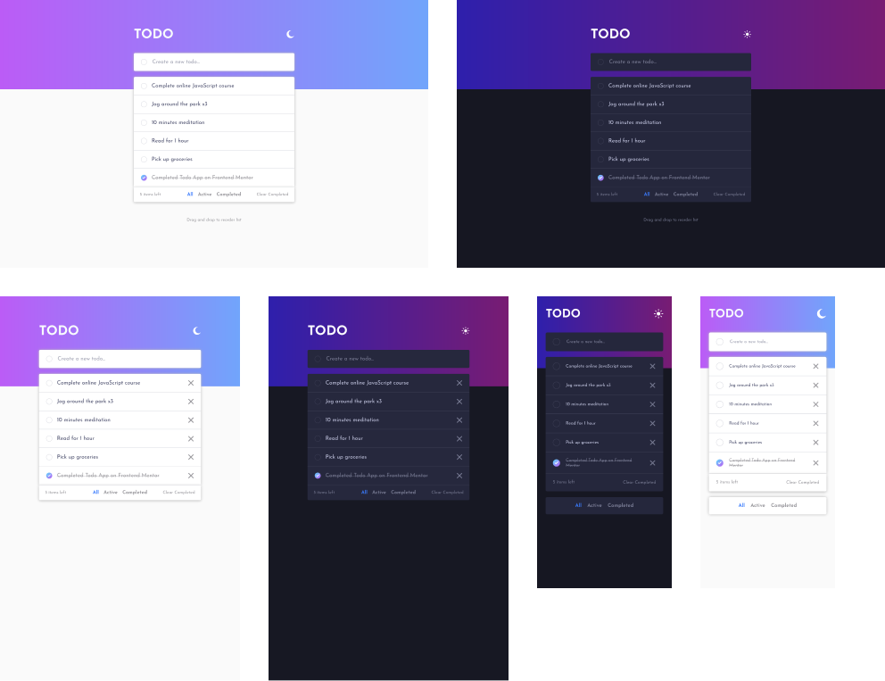
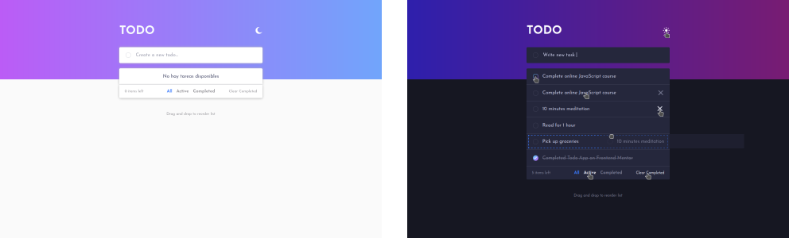

# Frontend Mentor - Todo app solution

This is a solution to the [Todo app challenge on Frontend Mentor](https://www.frontendmentor.io/challenges/todo-app-Su1_KokOW). Frontend Mentor challenges help you improve your coding skills by building realistic projects.

## Table of contents

- [Overview](#overview)
  - [The challenge](#the-challenge)
  - [Screenshot](#screenshot)
  - [Links](#links)
- [My process](#my-process)
  - [Built with](#built-with)
  - [What I learned](#what-i-learned)
  - [Continued development](#continued-development)
  - [Useful resources](#useful-resources)
- [Author](#author)
- [Acknowledgments](#acknowledgments)

## Overview

### The challenge

Users should be able to:

- View the optimal layout for the app depending on their device's screen size
- See hover states for all interactive elements on the page
- Add new todos to the list
- Mark todos as complete
- Delete todos from the list
- Filter by all/active/complete todos
- Clear all completed todos
- Toggle light and dark mode
- **Bonus**: Drag and drop to reorder items on the list in desktop
- **Bonus**: Show a message when there are no tasks available, in all, active and completed filters
- **Bonus**: Apply the theme by user color preferences

### Screenshot

#### Solution of the challenge view on mobile, tablet and desktop devices



#### Active states of solution



### Links

- [Solution URL](https://github.com/Alejandro25AR/Todo-app)
- [Live Site URL](https://alejandro25ar.github.io/Todo-app/)

## My process

### Built with

- Semantic HTML5 markup
- CSS custom properties
- Flexbox
- CSS Grid
- Mobile-first workflow
- Vanilla JS
  - Modules
  - Fragments
  - Local Storge

### What I learned

- Learned about using HTML templates and snippets to have more efficient code to interact with the DOM.
```html
<template id="template-name">
  <li class="name-classs">
    <p></p>
  </li>
</template>
```
```javascript
const $ul = getElementById("ul-example");

const $templateli = document.getElementById("ul-example");
const contentItem = document.querySelector('p');
contentItem.textContent = 'it is a example';

const $fragment = document.createDocumentFragment();
const $clone = document.importNode($templateTask,true);
$fragment.appendChild($clone);

$ul.appendChild($fragment);
```
- I learned how to customize checkboxes by binding them to a label and using the ::before and ::after psudo-elements
- I learned how to create color themes using css custom properties and preferred-color-schema.

### Continued development

- The BEMIT convention is very useful because it allows us to write maintainable styles.
- The use of guard clauses to make the source code more readable and maintainable.
- Apply transitions that are pleasing.
- Better modularize the code

### Useful resources

- [15+ Amazing CSS Checkbox Styles 2022 [Examples You'll Love] ](https://alvarotrigo.com/blog/css-checkbox-styles/) - When you see examples and code you can see how they were made and I managed to make the personalized checkbox that the challenge requested
- [Tema oscuro con puro SASS](https://programadorwebvalencia.com/tema-oscuro-en-puro-sass/) - It helped me to know how to use css custom properties to apply one property or another.
- [CSS Rounded Corners Gradient Border](https://getbutterfly.com/css-rounded-corners-gradient-border/) - It helped me to know that you can't use the `border: 1px solid linear-gradient(...);` property and that I should address the problem in another way, with `background`.
- [Drag and Drop Sortable List With Javascript (Simple Example)](https://code-boxx.com/drag-drop-sortable-list-javascript/) - It helped me understand how drag and drop works in Javascript.
- [¿Cómo detectar el evento del cierre de tu página web?](https://es.stackoverflow.com/questions/103956/c%C3%B3mo-detectar-el-evento-del-cierre-de-tu-p%C3%A1gina-web) - I understood how to use the close window event, and how to remove the `alert()` that by default executes the event, with `return null;`

## Author

- Frontend Mentor - [@Alejandro25AR](https://www.frontendmentor.io/profile/Alejandro25AR)
**Note: Delete this note and add/remove/edit lines above based on what links you'd like to share.**